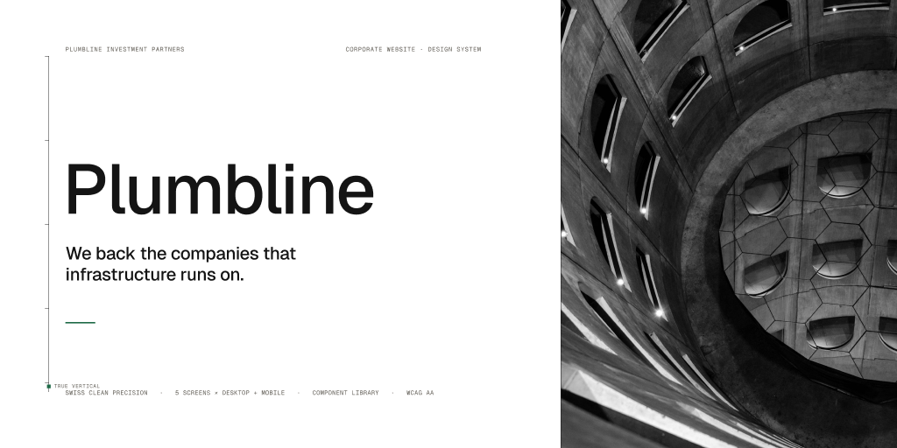
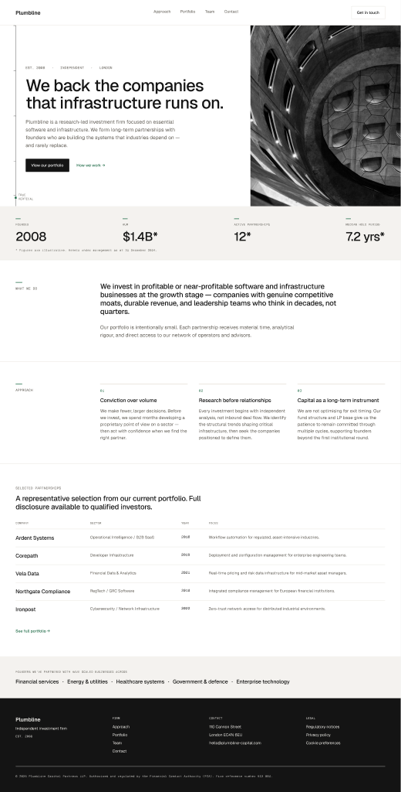
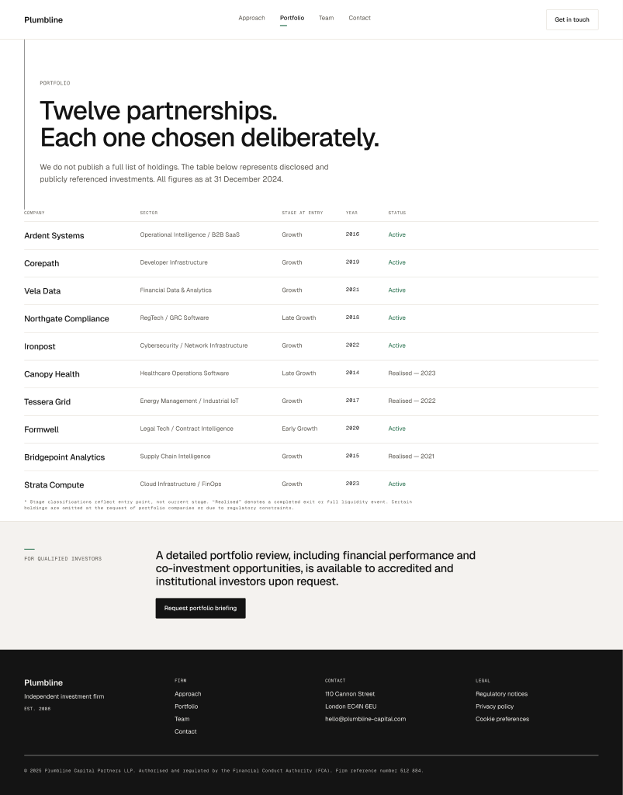
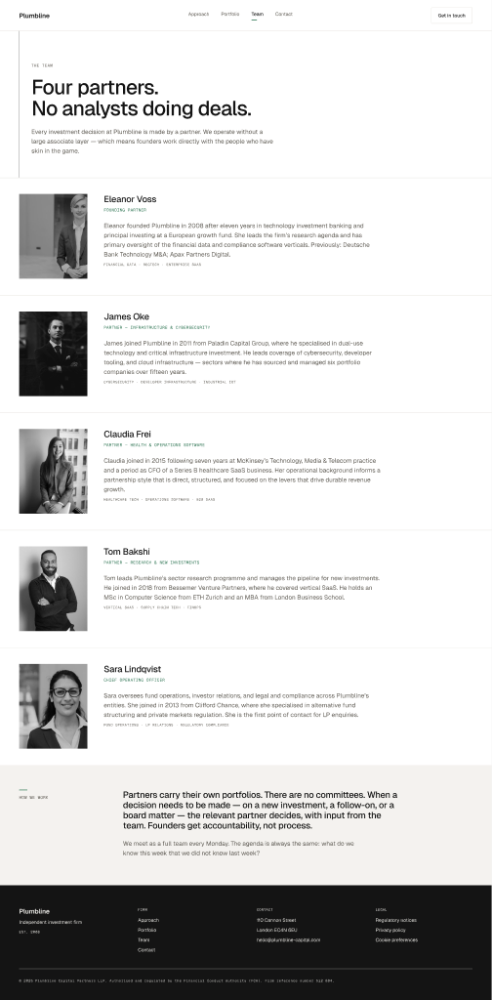
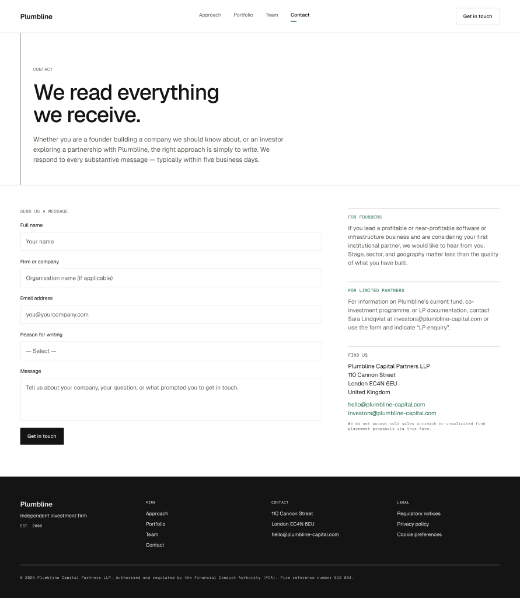
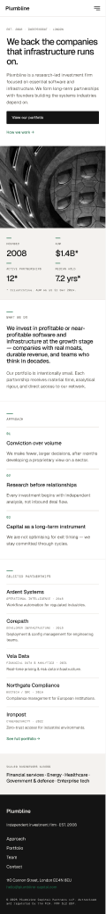
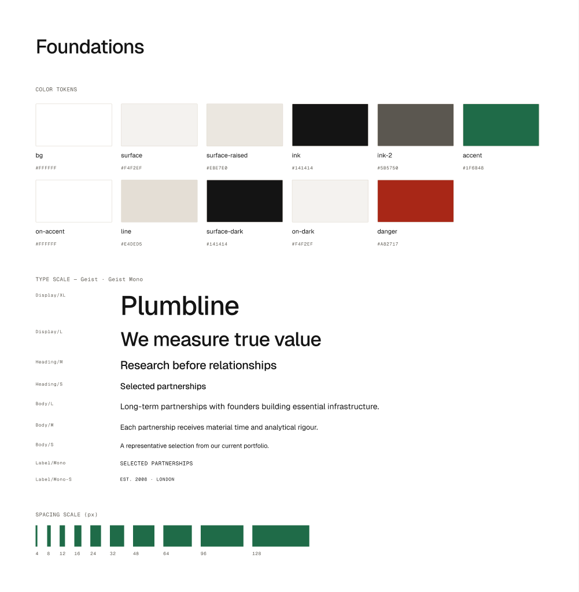

<div align="center">

# Design from References

### Learn aesthetics from the best-rated sites on the web — then generate original, accessible, production-grade Figma design systems.

*Nothing hardcoded. Every font and colour is **measured** from real award-winning sites. Every screen is **original**, **WCAG-checked**, and **component-driven**.*

<br/>



<br/>

[](https://claude.com/claude-code)
[](https://www.figma.com)
[](#-principles)


</div>

---

## What is this?

**Design from References** is a system of **[Claude Code](https://claude.com/claude-code) skills + agents** that does two things:

1. **Researches the best.** The `dataset-builder` agent goes online, navigates award-winning / highly-rated sites with Playwright, and **measures their real design DNA** — fonts and colours via `getComputedStyle`, full-page screenshots (desktop **and** mobile), and a written `design.md` analysis per site. The result is a reusable, *evidence-based* aesthetic dataset.

2. **Creates from it.** The `design-from-references` skill uses that dataset as **research material only** — then runs an *Originality Engine* (creative thesis, three territories, a signature element), the **webartist** method (UX laws, WCAG, anti-slop), and builds a complete **component-driven** design in Figma via the MCP, with parallel agents for copy, imagery, and QA.

> The reference sites teach *taste*. The agent invents the *product* — original copy, multiple screens, a real component library, and a sellable file structure.

---

## 🎨 The showcase — *Plumbline Investment Partners*

A full corporate-website design system generated end-to-end from the **"Swiss Clean Precision"** style cluster of the `corporate website` dataset.

- **Creative thesis** — *a plumbline finds true vertical*: a vertical reference line with measurement ticks and a weight runs through the layout — a signature derived from the brand name.
- **Measured palette** — warm paper `#f4f2ef` · ink `#141414` · deep green `#1f6b48` (the cluster's accent, darkened to pass WCAG AA). **Geist + Geist Mono** as declared substitutes for the real grotesques measured in the cluster.
- **Component-driven** — Foundations → Components (with states) → Screens **composed from instances**.
- **5 screens × desktop + mobile**, real B&W photography, full accessibility pass.

<table>
  <tr>
    <td width="50%"><br/><sub><b>Home</b> · hero + plumbline signature, metrics, data-table portfolio</sub></td>
    <td width="50%"><br/><sub><b>Portfolio</b> · 10-row editorial data table</sub></td>
  </tr>
  <tr>
    <td width="50%"><br/><sub><b>Team</b> · partner cards with real B&amp;W portraits</sub></td>
    <td width="50%"><br/><sub><b>Contact</b> · accessible form with field states</sub></td>
  </tr>
</table>

<table>
  <tr>
    <td width="32%"><br/><sub><b>Mobile</b> · single-column, hamburger nav</sub></td>
    <td width="68%"><br/><sub><b>Foundations</b> · colour tokens, type scale, spacing — all from measured data</sub></td>
  </tr>
</table>

---

## ⚙️ How it works

```
        ┌─────────────────┐     real award-winning / highly-rated sites
        │ dataset-builder │ ◀── Playwright: getComputedStyle + full-page shots
        └────────┬────────┘
                 │ writes  data/datasets/<category>/
                 ▼            ├── dataset.json   (measured fonts + colours + clusters)
                 │            └── <site>/{desktop.png, mobile.png, design.md}
        ┌────────▼─────────────────┐
        │ design-from-references   │  the orchestrator skill
        │  0 research (dataset)    │
        │  1 strategy + cluster    │
        │  2.5 ORIGINALITY ENGINE  │  thesis · territories · signature · trend filter
        │  3 plan + A11y/UX gates  │  contrast.js · ux-laws · content realism
        │  4 BUILD (Figma MCP)     │  Foundations → Components → Screens (instances)
        │  5 verify render gate    │  design-verifier (clipping/contrast/overflow)
        │  6 score + ship          │
        └──────────┬───────────────┘
                   │ parallel agents
        ┌──────────┴───────────────────────────────┐
        │ design-content · image-sourcer · design-verifier │
        └──────────────────────────────────────────┘
```

The long skill is split into a lean orchestrator (`SKILL.md`) plus **on-demand `references/`** files — so the gate detail loads only when needed (no context rot).

---

## 🧩 Architecture

| Piece | Path | Role |
|---|---|---|
| **Orchestrator skill** | `.claude/skills/design-from-references/` | Role, modes, gate overview + `references/*.md` (loaded on demand) |
| **Contrast tool** | `.claude/skills/.../scripts/contrast.js` | WCAG ratio CLI (Node, zero deps) |
| **Method** | `~/.claude/skills/webartist/` | UX laws, WCAG, anti-slop, motion (delegated to) |
| **Agents** | `.claude/agents/` | `dataset-builder`, `design-content`, `image-sourcer`, `design-verifier` |
| **Command** | `.claude/commands/crea-design.md` | `/crea-design` |
| **Dataset** | `data/datasets/<category>/` | Generated by the `dataset-builder` agent (one folder per category) |
| **Docs** | `docs/` | gate system + "sellable" Figma file blueprint |

---

## 🛡️ Principles

- **Measured, not hallucinated.** Fonts and colours come from real `getComputedStyle` data. The skill *forbids* default fonts/colours unless they trace to the dataset or a declared invention.
- **Original, not a clone.** The Originality Engine enforces an *anti-copy distance* (≥3 dimensions different from any single reference) and a proprietary **signature element**.
- **Accessible by gate.** Every text/background pair is measured with `contrast.js` (AA min); focus, target size, reduced-motion from the WCAG checklist.
- **Component-driven & sellable.** Build order is enforced: **Foundations → Components (with variants/states) → Screens from instances** — never the reverse. No empty pages, no cropped frames (bbox-verified).
- **Verified before "done".** A read-only `design-verifier` must pass (clipping, overflow, contrast, states) before any screen is declared finished.

---

## 🚀 Using it

Inside Claude Code, with the Figma MCP connected:

```text
# 1) Build / refresh a category dataset (real online research)
"Use the dataset-builder agent for the 'corporate website' category"

# 2) Generate a design
/crea-design        →  pick category + style cluster + language, then watch it build
```

The only external requirement is **Node** (for `contrast.js`). No server, no API keys, no build step.

---

## 📁 Repo structure

```
.claude/
  skills/design-from-references/   orchestrator + references/ + scripts/
  agents/                          dataset-builder · design-content · image-sourcer · design-verifier
  commands/crea-design.md
data/datasets/<category>/          generated by the dataset-builder agent (one per category)
docs/                              system docs + screenshots/
```

---

## 📝 Credits & licensing (showcase)

Plumbline is a **fictional brand** built as a design comp. Photography is royalty-free (Unsplash License): hero by *Kilyan Sockalingum*; portraits by *Vitaly Gariev, Ali Morshedlou, Christina @ wocintechchat.com, Willian Souza*. Figures marked `*` are illustrative. Measured reference fonts are credited in the file's **Foundations & Docs** page.

<div align="center"><sub>Made with Claude Code · Figma MCP · the webartist method</sub></div>
